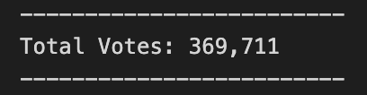
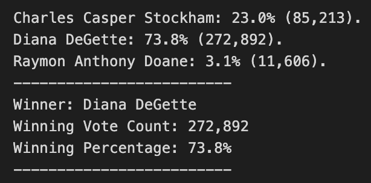
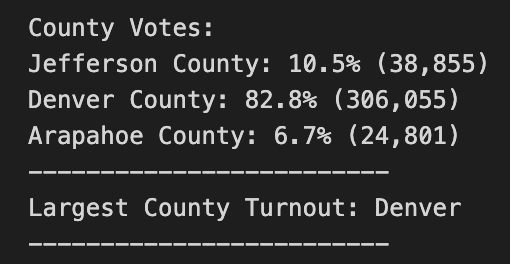
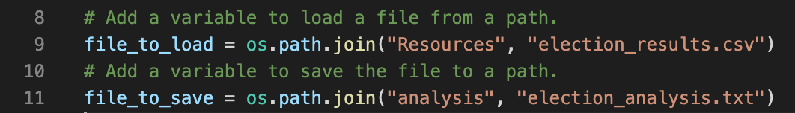

# State Election Audit
Analyst: <code><i> Stanley Misina, Columbia University Data Analytics Bootcamp</i></code> 
Analysis Tools Used: <i><code> Python 3.9.5, Visual Studio Code, 1.57.1 </i></code> 
Data Source Provided: <i><code> election_results.csv - provided by the Colorado Board of Elections </code></i>

## Project Overview
As a request from the state board, county analysis is requested to be provided along with the candidate analysis. This will provide insight into participation by county by considering voter turnout by ballots cast. Futhermore, the county with the largest turnout is to be identified separately.

## Data Exploration
The analysis of the election shows there were a total of ***369,711*** votes cast in this election. 

This project pulls out the unique names of the candidates, and tabulates their individual votes across the entire district.
#### The candidates were:
1. Charles Casper Stockham
2. Diana DeGette
3. Raymon Anthony Doane

#### The candidate results were:

Candidate Diana DeGette won in a landslide by securing 73.8% of all votes tallied in the district.

## Summary
County participation was calculated from the data source and provided as part of the whole analysis presented here. Each individual county name was pulled and total votes tabulated on the county name.

#### The turnout by county with percentage of total participation in district:

Denver County had the most influence in the election as 82.8% of all ballots cast were from
this one county.

#### Analyst's Note:
- This code can be modified to work with any csv file that is in a column format of "ballot_id,county_name, candidate_name" as the line item results. Update line 8 to the pertinant file name in place of "election_results.csv", and include it in the "Resources" folder.
- You can also modify the output destination by pointing to another filename of your choice in line 10, replacing "election_analysis.txt" with the desired output file name.
- Please note, if making these adjustments, realize the code is pointing to the 'Resources' and 'analysis' directories. This code uses relative paths and changing their target directories could pose a challenge in retrieving, tabulating, and outputting your results.

